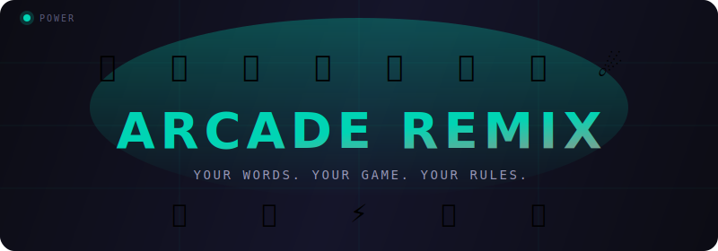
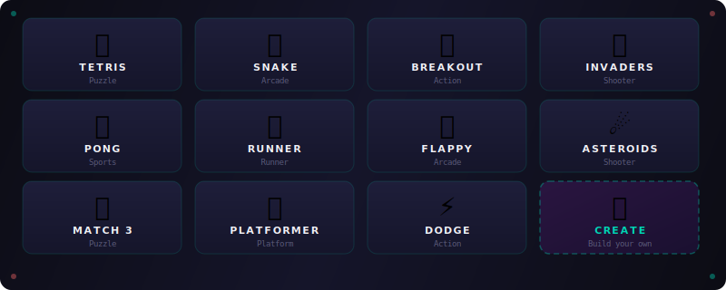

<p align="center">
  
</p>

<h3 align="center">What if Tetris blocks were made of penguins?<br>What if Space Invaders were angry emojis?<br>What if your Pong paddle was a stack of ducks?</h3>

<p align="center">
  Pick a classic game. Describe your version. Play it instantly.
</p>

<p align="center">
  <a href="https://stuckinthenet.github.io/arcade-remix/"><b>Play Now</b></a>
</p>

---

## How it works

Every game has 4 prompts. Type anything. The game transforms to match.

Type **"penguin"** for Tetris blocks and every piece becomes 🐧. Type **"duck"** for Pong paddles and your paddle is a column of 🦆. Type **"explode"** for line clears and completed lines burst into fire particles.

Not sure what to type? Keyword chips below each input show what triggers effects. Click one to auto-fill. Or type whatever you want. Every input generates a unique color and style, even if it's not a recognized keyword.

---

## Games

<p align="center">
  
</p>

**11 games** across 6 genres, plus a custom game builder.

| Game | What it is | Controls |
|------|-----------|----------|
| **Tetris** | Stack blocks, clear lines | Arrows/WASD, Space drop |
| **Snake** | Eat, grow, don't crash | Arrows/WASD |
| **Breakout** | Smash bricks with a ball | Arrows/Mouse, Space launch |
| **Invaders** | Blast the alien swarm | Arrows, Space shoot |
| **Pong** | Classic paddle battle vs CPU | Arrows/WS |
| **Runner** | Run, jump, survive | Space/Up |
| **Flappy** | Flap through the gaps | Space/Up/Click |
| **Asteroids** | Dodge and destroy space rocks | Arrows steer, Space shoot |
| **Match 3** | Swap gems, chain combos | Click to swap |
| **Platformer** | Jump between platforms | Arrows/WASD, Space jump |
| **Dodge** | Dodge falling chaos | Arrows/AD |

**ESC** to pause. **EXIT** to return to menu.

---

## Create mode

Hit the **Create** card to remix any engine with fresh prompts.

Pick a template (Shooter, Dodger, Runner, Climber, Breaker, Puzzler), fill in your own prompts, and play a unique version built on an existing engine.

---

## Theme system

Every input transforms the game across 5 layers:

| Layer | What happens |
|-------|-------------|
| **Emoji** | Game elements become emoji ("penguin" blocks = 🐧, "duck" paddles = 🦆) |
| **Material** | Blocks change shape and texture ("slime" = green goo, "lava" = animated cracks) |
| **Particles** | Destruction effects change ("melt" = dripping, "shatter" = flying shards) |
| **Color** | Palette shifts to match ("fire" = reds, "ocean" = blues, or any word = unique hash color) |
| **Background** | Environment transforms ("space" = starfield, "neon" = grid, "volcano" = red gradient) |

---

## Run it

```bash
python3 -m http.server 8080
```

Or just open `index.html`. Zero dependencies.

---

## Tech

Vanilla HTML/CSS/JS. No frameworks, no build step, no backend.

11 game engines, each a self-contained ES6 class rendering on a shared canvas. Theme values are passed to the constructor and keyword matching happens in the draw loop. Unrecognized words get hashed into unique colors and styles.

**10,600+ lines** of pure browser arcade.

---

## License

MIT
